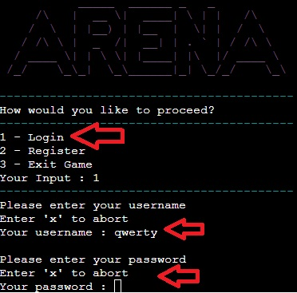

# **Arena**

Developed by Oğuzhan Akça

[Live Site](https://arena-fight-977683a914a6.herokuapp.com/)

## Introduction

Arena is a Python terminal game, which runs in the Code Institute mock terminal on Heroku. It is a turn-based fighting game that challenges users with different types of enemies. The objective of the game is facing varius type of enemies and getting better equipment with the gold they earn from challenges. In order to beat the game, users have to challenge with the boss "Demon King".

Users must use their special attack at the right time to beat their enemies. Otherwise enemies will recover a huge part of their health.

Even users lose a fight, they can still keep playing. But they will lose a decent amount of gold as a penalty.

Users should create an account to be able to play. They can also use the account whenever they want without losing their progress. Every user can give once a feedback after they beat the game.

## Contents

- [Project Goals](#project-goals) 
  - [User Goals](#user-goals)
  - [Site Owner Goals](#site-owner-goals)
- [User Experience](#user-experience) 
  - [Target Audience](#target-audience)
  - [User Requirements](#user-requirements)
  - [User Stories](#user-stories)
  - [User Manual](#user-manual)
- [Technical Design](#technical-design)
  - [Flowchart](#flowchart)
  - [Data Models](#data-models)
- [Features](#features)
- [Feature Ideas for future development](#feature-ideas-for-future-development)
- [Technologies Used](#technologies-used)
- [Deployment & Local Development](#deployment--local-development)
- [Validation](#validation)
- [Testing](#testing)
  - [User Story Test](#manual-testing)
- [Bugs](#bugs)
- [Credits](#credits)

## Project Goals

### User Goals

- Playing a challenging turn-based combat game.
- To be able to play again from where i stopped.

### Site Owner Goals

- Create a challenging game.
- To ensure users have a fun time.

## User Experience

### Target audience

- Users who like to play turn-based combat games
- Users who like to spend time on grinding.

### User requirements

- A game that is understandable and works as expected.
- Log-in and sign up works as expected.
- Users can quit the game whenever they want.
- Even if users leave the game, they can keep their progress and continue from where they left.

### User Stories

#### As a new user,

1. I want to create an account.
2. I want to read the guide.
3. I want to leave feedback.
4. I want to see my stats.
5. I want to see how much gold i have.
6. I want to change my equipment.
7. I want to easily navigate within the game.
8. I want to see enemy list.
9. I want to choose different actions in combat.

#### As a returning user,

10. I want to login to my account.
11. I want to remember how to play.
12. I want to leave feedback.
13. I want to see my stats.
14. I want to see how much gold i have.
15. I want to change my equipment.
16. I want to easily navigate within the game.
17. I want to see enemy list.
18. I want to choose different actions in combat.

#### As the site owner,

19. I want users to create account.
20. I want users to log in the existing account.
21. I want users to learn how to play.
22. I want users to easily navigate within the game.
23. I want users to see their current stats.
24. I want users to see the current gold they have.
25. I want users to change their equipment.
26. I want users to be able to give feedback.
27. I want users to see enemy list.
28. I want users to have different actions in combat.

### User Manual

View Manual

### Start Menu

When the program starts, the user will be asked whether to log in or register.

- Users will be navigated by their prompt
- Every input will be validated whether its invalid input or not.

### Log in

The program will ask user to type their username and password. To login successfully:

- Username will be checked whether it exists in database or not.
- Password will be checked whether its correct or not.
- Process can be aborted with "x" input.

### Register

The program will ask user to type their desired username(which will be the name of user's character) and password. To register successfully:

- Username must be between 5 and 15 characters long.
- Username must only contain alphabetic characters.
- Username must not contain any spaces.
- Username must not already exist.
- Password must be between 5 and 15 characters long.
- Password must not contain any spaces.
- Process can be aborted with "x" input.

PS :
Passwords are case sensitive. Usernames are not.

### Main menu

After successfully logged in, the user will be navigated to main menu. Here users will see the options:

1. Visit Shop
2. Enter Arena
3. Stats
4. How to play
5. Quit game

Users can navigate through by the numbers every option has.

### Shop

It will display after the player chooses to visit shop. The user will have 3 options:

1. Weapon Shop
2. Armor Shop
3. Leave Shop

If the user chooses the 3rd option, they will be navigated back to main menu.
If the user chooses anything else than leaving shop, they will be navigated to the shop they choosed.

### Weapon and Armor shop

Every shop will load their own content from the database. If the users have enough gold, they can buy their equipment here.

- When the user tries to buy something that is worse or equal to their current equipment, they will be asked if they still want to do it or not.

### Enter Arena

It will display the enemies user can face and leave arena option. Every enemy will drop some amount of gold that user can use to upgrade their equipment.

- It is recommended to kill enemies with the order they listed.
- Users should try to upgrade their equipment to face stronger enemies.
- Users will lose decent amount of gold if they lose a fight.

### Stats

It will show current stats of the user with the weapon and armor included.

### How to play

It will display a guide to the users. Users can press 1 to return to main menu.

### Combat

When users decides to face an enemy, combat system will appear. Every round users will be asked which action they want to do:

1. Attack
2. Special Attack
3. Run Away

- Attack option deals damage to the enemy equal to the player's damage.
- Special attack option deals 2x damage the user will do. Also stuns enemy in that round. Users can block enemies recover skill with special attack.
- Special attack has a cooldown. To activate it again, user must land a successful normal attack.
- Everyone can deal critical damage which is 2x of their damage. If special attack deals critical damage, it will deal 4x of user's damage.
- Armors reduce attacker's damage.
- Everyone can dodge attacks depending on their evasion stat
- User can attempt to run away from the fight. It has 25% success rate. If user fails to run away, they will skip their turn.

### Completing the game

To beat the game, user must defeat the Demon King, which will be showed in Arena Menu.

### Feedback

The user will be asked once they finish the game to give feedback.

- Every account can give only one feedback.
- If users didn't give an feedback once they clear the game, they can kill the Demon King again and give feedback.

 

## Technical Design

### Flowchart

The flowchart created by using [Lucidchart](https://lucid.app/) to visualise the logic flow of the game.

    
Flowchart

    

 

### Data Models

I decided to eight classes in this project. The classes used in this project are:

1. Player : Holds the data of logged user.
2. Stats : Calculates the stats of user included weapon and armor
3. Weapon : Holds the current weapon data of the user
4. Armor : Holds the current armor data of the user
5. Enemy : Holds the data of the enemy that has chosen in arena
6. PlayerCombat : Holds the data of user in combat
7. EnemyCombat : Holds the data of enemy in combat
8. Combat : The class that has methods to perform the fight
   - The combat class also has methods to handle the combat for enemy and user side.

- The Google Sheets API was used for keeping user data, weapon, armor, enemy and user feedback submissions.
  - This allows users to keep their progress even when they exit the game.

## Features

The website has a single page with several features within the mock python terminal. These features are listed below.

- Each feature has its own validation against user input.

### Start Screen

It will be shown when user start the program.

- Displays the name of program
- Asks users whether they want to register or login
- User stories covered: 1, 10, 19, 20

### Login

Shown when the user selects the login option

- Prompts users for their username and password
- Usernames are not case sensitive.
- Passwords are case sensitive.
- Validates if username exists and password is correct.
- User stories covered: 10, 20

### Register

Shown when the user selects the register option

- Prompts users for their desired username and password
- Usernames are not case sensitive.
- Passwords are case sensitive.
- Validates if username exists or in correct format.
- Validates if password is in correct format.
- User stories covered: 1, 19

### Main Menu

Shown after successful login. The main navigation menu of the game.

- Displays user's name.
- Asks users what they want to do.
- Validates against wrong input.
- User stories covered: 7, 16, 22

### Shops

Shown after the user selects Visit Shop option

- Allows users to improve their equipment
- Displays the stats and prices of the items.
- Each shop validates whether user has enough gold or not.
- Each shop validates whether the desired equipment is equal or better than current equipment.
- Users can navigate back to main menu.
- Validates against wrong input.
- User stories covered: 5, 6, 14, 15, 24, 25

### Arena

Shown after the user selects Enter Arena option

- Allows users to choose which enemy they want to face.
- Users can navigate back to main menu.
- Validates against wrong input.
- User stories covered: 8, 17, 27

### Stats

Shown after the user selects Stats option

- Displays user's currently equipped weapon and armor.
- Displays user's current stats.
- Users can navigate back to main menu.
- Validates against wrong input.
- User stories covered: 4, 13, 23

### How to Play

Shown after the user selects How to Play option.

- It shows the guide related to the game.
- Users can also find some tips about the game.
- Users can navigate back to main menu.
- Validates against wrong input.
- User stories covered: 2, 11, 21

### Combat

Shown after the user selects an enemy from Arena.

- Displays current/max health of both user and enemy.
- Displays current round.
- Gives users three action options.
- After the user's decision, simulates the fight.
- If users choose "run away" option, they can navigate back to main menu.(This option has 25% chance to success.)
- Automatically navigates to main menu after the fight ends.
- Validates against wrong input.
- User stories covered: 9, 18, 28

### Feedback

Shown after the user finished the game.

- Asks users if they want to give a feedback.
- Each account can only provide one feedback.
- No matter what the choice is, it exists game after the selection.
- Validates against empty input.
- User stories covered: 3, 12, 26

### Feature ideas for future development

- Various types of enemies can be added.
- Various types of actions, skills can be added.
- Various types of items can be added.
- Quest system can be added.

## Technologies Used

### Languages used

Python

### Other Tools

- [Lucidchart](https://www.lucidchart.com/)
- [Git](https://git-scm.com/)
- [GitHub](https://github.com/)
- [Heroku](https://www.heroku.com/)
- [Ascii art generator](https://patorjk.com/software/taag/#p=display&f=Big&t=ARENA)
- [amiresponsive](https://ui.dev/amiresponsive)

#### 3rd party Python Libraries used

- [Gspread / Google Sheets API](https://github.com/burnash/gspread)
- [Google OAuth](https://google-auth.readthedocs.io/en/stable/reference/google.oauth2.credentials.html)
- [Colorama](https://pypi.org/project/colorama/)
- [OS](https://docs.python.org/3/library/os.html)

## Deployment & Local Development

The website was deployed to [Heroku](https://www.heroku.com/) using the following process:

1. Login or create an account at [Heroku](https://www.heroku.com/)
   
2. Click on New > Create new app in the top right of the screen.
   
3. Decide an app name and select location, then click 'create app'.
   
4. Move to the deploy tab and select GitHub Connect.
   
5. Log in to your GitHub account when prompted and give permission for it.
6. Under the Deployment Method, select the repository that you want to be connected to the Heroku app.
   
7. Move to the Settings tab.
   
8. Scroll down to the config vars section, and add 2 config vars:
   _ The first key is CREDS and the value here is the creds.json file that was generated for the google sheets API to work properly.
   _ The second key is PORT and the Value is 8000
   
9. Once you have set up the config vars, scroll down to buildpacks (still under the settings tab)
10. Add the Python and Node.js buildpacks to your app and make sure that when they are displayed, they appear in the order:
    _ Python
    _ Node.JS
    
11. Navigate back to the Deploy tab.
12. In the 'manual deploy' section beneath this, make sure the branch selected is 'main' and click deploy branch.
    
13. Select automatic deploys to allow Heroku to build the site with new changes each time changes are pushed to GitHub.
    

14. The site should now be built and Heroku should provide a url for the built site.

This repository can be forked using the following process:

1. On the repository's page, go to the top-right of the page underneath the dark ribbon.
2. Click on the fork button
3. You can now work on a fork of this project.

This repository can be cloned using the following process:

1. Go to this repository's page on GitHub.
2. Click on the code button (not the one in the navbar, but the one right above the file list).
3. Select an option, HTTPS, SSH, GitHub CLI.
4. Copy the url below to your clipboard.
5. Open Git Bash/your IDE terminal.
6. Ensure the directory you are working in is the correct one you want to paste the project into.
7. Type the command '$ git clone'
8. Paste the URL of the repository after this.
9. Hit enter on your keyboard and the project will be cloned.

## Validation

#### PEP8 Python Validator (from Code Institute)

Code institute's own Python Linter [pep8](https://pep8ci.herokuapp.com/) was used to validate all Python code in this project.

Errors found by the validator:

- W291 trailing whitespace
- W605 invalid escape sequence
- E501 line too long
- E302 expected 2 blank lines

All errors found by the validator have been fixed.

game_objects.py

game.py

run

sheets

validation

## Testing

### Debugging

The site was tested using the following browsers:

- Google Chrome
- Opera
- Microsoft Edge

### User Story Test

#### As a new user,

| User story                      | Feature  | Test                                                                                                  | Expected Result                                                 | Actual Result      |
| ------------------------------- | -------- | ----------------------------------------------------------------------------------------------------- | --------------------------------------------------------------- | ------------------ |
| 1. I want to create an account. | Register | When game starts, enter "2" as input. Then user will be asked for their desired username and password | Program validates username and password then signs the user up. | Works as expected. |

    
Screenshot

    

| User story                   | Feature     | Test                                         | Expected Result                                                      | Actual Result      |
| ---------------------------- | ----------- | -------------------------------------------- | -------------------------------------------------------------------- | ------------------ |
| 2. I want to read the guide. | How to play | In the main menu, enter '4' to access guide. | Program prints instructions, tips and a way to get back to the menu. | Works as expected. |

    
Screenshot

    

| User story                   | Feature  | Test                                                                                | Expected Result                                                                                                                             | Actual Result      |
| ---------------------------- | -------- | ----------------------------------------------------------------------------------- | ------------------------------------------------------------------------------------------------------------------------------------------- | ------------------ |
| 3. I want to leave feedback. | Feedback | When the user finishes the game, they will be asked whether give a feedback or not. | If user enters "y", program will validate if they gave a feedback with their current account. If no, user will be asked for their feedback. | Works as expected. |

    
Screenshots

    

| User story                 | Feature | Test                                              | Expected Result                                                         | Actual Result      |
| -------------------------- | ------- | ------------------------------------------------- | ----------------------------------------------------------------------- | ------------------ |
| 4. I want to see my stats. | Stats   | In the main menu, enter "3" to access user stats. | Program prints user's current stats including current weapon and armor. | Works as expected. |

    
Screenshots

    

| User story                             | Feature | Test                                                                                                                  | Expected Result                                                                   | Actual Result      |
| -------------------------------------- | ------- | --------------------------------------------------------------------------------------------------------------------- | --------------------------------------------------------------------------------- | ------------------ |
| 5. I want to see how much gold i have. | Shops   | In the main menu, enter "1" to visit a shop. Then enter any shop input to see their items and how much gold you have. | Program prints current equipment and gold, with the items they can buy from shop. | Works as expected. |

    
Screenshots

    

| User story                        | Feature | Test                                                                                                                                                                     | Expected Result                                                                                                                              | Actual Result      |
| --------------------------------- | ------- | ------------------------------------------------------------------------------------------------------------------------------------------------------------------------ | -------------------------------------------------------------------------------------------------------------------------------------------- | ------------------ |
| 6. I want to change my equipment. | Shops   | In the main menu, enter "1" to visit a shop. Then enter any shop input to see their items and how much gold you have. The user need to enter the id of the desired item. | Program will check if user has better or same gear as desired weapon. If yes, user will be asked to be sure. Then purchase will be completed | Works as expected. |

    
Screenshots

    

| User story                                    | Feature   | Test                                                         | Expected Result                                     | Actual Result      |
| --------------------------------------------- | --------- | ------------------------------------------------------------ | --------------------------------------------------- | ------------------ |
| 7. I want to easily navigate within the game. | Main Menu | In the main menu, user can enter desired number to navigate. | Program checks if user input is valid, then proceed | Works as expected. |

    
Screenshots

    

| User story                   | Feature    | Test                                       | Expected Result                                        | Actual Result      |
| ---------------------------- | ---------- | ------------------------------------------ | ------------------------------------------------------ | ------------------ |
| 8. I want to see enemy list. | Enemy List | In the main menu, enter '2' to enter arena | Program will print all the enemies user can challenge. | Works as expected. |

    
Screenshots

    

| User story                                       | Feature | Test                                                  | Expected Result                                 | Actual Result      |
| ------------------------------------------------ | ------- | ----------------------------------------------------- | ----------------------------------------------- | ------------------ |
| 9. I want to choose different actions in combat. | Combat  | Choose the enemy you want to face, then combat starts | User will be asked for their actions in combat. | Works as expected. |

    
Screenshots

    

#### As a returning user,

| User story                         | Feature | Test                                                        | Expected Result                            | Actual Result      |
| ---------------------------------- | ------- | ----------------------------------------------------------- | ------------------------------------------ | ------------------ |
| 10. I want to login to my account. | Login   | Enter login in the start screen Then press enter to submit. | Program sends message to the google sheet. | Works as expected. |

    
Screenshots

    

| User story                          | Feature     | Test                                         | Expected Result                                                      | Actual Result      |
| ----------------------------------- | ----------- | -------------------------------------------- | -------------------------------------------------------------------- | ------------------ |
| 11. I want to remember how to play. | How to play | In the main menu, enter '4' to access guide. | Program prints instructions, tips and a way to get back to the menu. | Works as expected. |

    
Screenshot

    

| User story                    | Feature  | Test                                                                                | Expected Result                                                                                                                             | Actual Result      |
| ----------------------------- | -------- | ----------------------------------------------------------------------------------- | ------------------------------------------------------------------------------------------------------------------------------------------- | ------------------ |
| 12. I want to leave feedback. | Feedback | When the user finishes the game, they will be asked whether give a feedback or not. | If user enters "y", program will validate if they gave a feedback with their current account. If no, user will be asked for their feedback. | Works as expected. |

    
Screenshots

    

| User story                  | Feature | Test                                              | Expected Result                                                         | Actual Result      |
| --------------------------- | ------- | ------------------------------------------------- | ----------------------------------------------------------------------- | ------------------ |
| 13. I want to see my stats. | Stats   | In the main menu, enter "3" to access user stats. | Program prints user's current stats including current weapon and armor. | Works as expected. |

    
Screenshots

    

| User story                              | Feature | Test                                                                                                                  | Expected Result                                                                   | Actual Result      |
| --------------------------------------- | ------- | --------------------------------------------------------------------------------------------------------------------- | --------------------------------------------------------------------------------- | ------------------ |
| 14. I want to see how much gold i have. | Shops   | In the main menu, enter "1" to visit a shop. Then enter any shop input to see their items and how much gold you have. | Program prints current equipment and gold, with the items they can buy from shop. | Works as expected. |

    
Screenshots

    

| User story                         | Feature | Test                                                                                                                                                                     | Expected Result                                                                                                                              | Actual Result      |
| ---------------------------------- | ------- | ------------------------------------------------------------------------------------------------------------------------------------------------------------------------ | -------------------------------------------------------------------------------------------------------------------------------------------- | ------------------ |
| 15. I want to change my equipment. | Shops   | In the main menu, enter "1" to visit a shop. Then enter any shop input to see their items and how much gold you have. The user need to enter the id of the desired item. | Program will check if user has better or same gear as desired weapon. If yes, user will be asked to be sure. Then purchase will be completed | Works as expected. |

    
Screenshots

    

| User story                                     | Feature   | Test                                                         | Expected Result                                     | Actual Result      |
| ---------------------------------------------- | --------- | ------------------------------------------------------------ | --------------------------------------------------- | ------------------ |
| 16. I want to easily navigate within the game. | Main Menu | In the main menu, user can enter desired number to navigate. | Program checks if user input is valid, then proceed | Works as expected. |

    
Screenshots

    

| User story                    | Feature    | Test                                       | Expected Result                                        | Actual Result      |
| ----------------------------- | ---------- | ------------------------------------------ | ------------------------------------------------------ | ------------------ |
| 17. I want to see enemy list. | Enemy List | In the main menu, enter '2' to enter arena | Program will print all the enemies user can challenge. | Works as expected. |

    
Screenshots

    

| User story                                        | Feature | Test                                                  | Expected Result                                 | Actual Result      |
| ------------------------------------------------- | ------- | ----------------------------------------------------- | ----------------------------------------------- | ------------------ |
| 18. I want to choose different actions in combat. | Combat  | Choose the enemy you want to face, then combat starts | User will be asked for their actions in combat. | Works as expected. |

    
Screenshots

    

#### As the site owner,

| User story                          | Feature  | Test                                                                                                  | Expected Result                                                 | Actual Result      |
| ----------------------------------- | -------- | ----------------------------------------------------------------------------------------------------- | --------------------------------------------------------------- | ------------------ |
| 19. I want users to create account. | Register | When game starts, enter "2" as input. Then user will be asked for their desired username and password | Program validates username and password then signs the user up. | Works as expected. |

    
Screenshot

    

| User story                                       | Feature | Test                                                        | Expected Result                            | Actual Result      |
| ------------------------------------------------ | ------- | ----------------------------------------------------------- | ------------------------------------------ | ------------------ |
| 20. I want users to log in the existing account. | Login   | Enter login in the start screen Then press enter to submit. | Program sends message to the google sheet. | Works as expected. |

    
Screenshots

    

| User story                             | Feature     | Test                                         | Expected Result                                                      | Actual Result      |
| -------------------------------------- | ----------- | -------------------------------------------- | -------------------------------------------------------------------- | ------------------ |
| 21. I want users to learn how to play. | How to play | In the main menu, enter '4' to access guide. | Program prints instructions, tips and a way to get back to the menu. | Works as expected. |

    
Screenshot

    

| User story                                           | Feature   | Test                                                         | Expected Result                                     | Actual Result      |
| ---------------------------------------------------- | --------- | ------------------------------------------------------------ | --------------------------------------------------- | ------------------ |
| 22. I want users to easily navigate within the game. | Main Menu | In the main menu, user can enter desired number to navigate. | Program checks if user input is valid, then proceed | Works as expected. |

    
Screenshots

    

| User story                                   | Feature | Test                                              | Expected Result                                                         | Actual Result      |
| -------------------------------------------- | ------- | ------------------------------------------------- | ----------------------------------------------------------------------- | ------------------ |
| 23. I want users to see their current stats. | Stats   | In the main menu, enter "3" to access user stats. | Program prints user's current stats including current weapon and armor. | Works as expected. |

    
Screenshots

    

| User story                                          | Feature | Test                                                                                                                  | Expected Result                                                                   | Actual Result      |
| --------------------------------------------------- | ------- | --------------------------------------------------------------------------------------------------------------------- | --------------------------------------------------------------------------------- | ------------------ |
| 24. I want users to see the current gold they have. | Shops   | In the main menu, enter "1" to visit a shop. Then enter any shop input to see their items and how much gold you have. | Program prints current equipment and gold, with the items they can buy from shop. | Works as expected. |

    
Screenshots

    

| User story                                  | Feature | Test                                                                                                                                                                     | Expected Result                                                                                                                              | Actual Result      |
| ------------------------------------------- | ------- | ------------------------------------------------------------------------------------------------------------------------------------------------------------------------ | -------------------------------------------------------------------------------------------------------------------------------------------- | ------------------ |
| 25. I want users to change their equipment. | Shops   | In the main menu, enter "1" to visit a shop. Then enter any shop input to see their items and how much gold you have. The user need to enter the id of the desired item. | Program will check if user has better or same gear as desired weapon. If yes, user will be asked to be sure. Then purchase will be completed | Works as expected. |

    
Screenshots

    

| User story                                    | Feature  | Test                                                                                | Expected Result                                                                                                                             | Actual Result      |
| --------------------------------------------- | -------- | ----------------------------------------------------------------------------------- | ------------------------------------------------------------------------------------------------------------------------------------------- | ------------------ |
| 26. I want users to be able to give feedback. | Feedback | When the user finishes the game, they will be asked whether give a feedback or not. | If user enters "y", program will validate if they gave a feedback with their current account. If no, user will be asked for their feedback. | Works as expected. |

    
Screenshots

    

| User story                          | Feature    | Test                                       | Expected Result                                        | Actual Result      |
| ----------------------------------- | ---------- | ------------------------------------------ | ------------------------------------------------------ | ------------------ |
| 27. I want users to see enemy list. | Enemy List | In the main menu, enter '2' to enter arena | Program will print all the enemies user can challenge. | Works as expected. |

    
Screenshots

    

| User story                                            | Feature | Test                                                  | Expected Result                                 | Actual Result      |
| ----------------------------------------------------- | ------- | ----------------------------------------------------- | ----------------------------------------------- | ------------------ |
| 28. I want users to have different actions in combat. | Combat  | Choose the enemy you want to face, then combat starts | User will be asked for their actions in combat. | Works as expected. |

    
Screenshots

    

### Bugs

| Bug Description                                                                                          | Action Taken to Fix                                                                                                |
| -------------------------------------------------------------------------------------------------------- | ------------------------------------------------------------------------------------------------------------------ |
| The user could register with empty username/password or with usernames/passwords that contains space     | Added a validation function to check if inputs are empty                                                           |
| After purchasing any item, stats were not updating                                                       | After purchase, Stat class will be created again with current user items                                           |
| When user enters a value other than "1" in how to play section, program crashes because of infinite loop | A validation for different input added to prevent infinite loops                                                   |
| Enemies were trying to use special attack even its just a feature for players                            | A validation added to check if attacker has "stunned" attribute, which only enemies have.                          |
| Users can spam feedback                                                                                  | Added a bool value for every account that shows if a player sent feedback. Also added a validation that checks it. |

## Credits

### 3rd party code used

#### 3rd party Python libraries/modules

- [Gspread / Google Sheets API](https://github.com/burnash/gspread) was used to handle getting/sending data to the google sheet used in the project.
- [Google OAuth 2.0](https://google-auth.readthedocs.io/en/stable/reference/google.oauth2.credentials.html) was used to set up the connection between the project and the developers personal google account.
- [Colorama](https://pypi.org/project/colorama/) was used to add colour to increase visual appeal for users.
- [Ascii art generator](http://patorjk.com/software/taag/#p=display&f=Varsity&t=Dungeon%0AEscape) was used to generate title text.

#### Codes.

- Clear Terminal with Python: [Stackoverflow](https://stackoverflow.com/questions/2084508/clear-the-terminal-in-python)

### Acknowledgements

I would like to take the opportunity to thank my mentor Mo Shami for his guidance and support.
